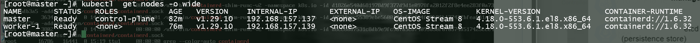

# <a href="https://kubernetes.io"></a>  Kubernetes-clusture-kubeadm
Create kubernetes v1.29 clusture using kubeadm in centos-8 
## Snaphot 


#  Kubernetes Installation Steps  

This document outlines the steps to install and configure Kubernetes on a Linux system, including firewall configurations and the installation of required components.

## Note: 
Before installation, both machines should be able to ping each other, whether in the cloud or on a virtual machine (VM).
Check this by using the command: `ping <IP>`.
```sh
ping -c 4 <IP-Machine-2>
```
```sh
ping -c 4 <IP-Machine-1>
```
## Table of Contents

1. [Firewall Allow Ports](#firewall-allow-ports)
2. [Disable Swap](#disable-swap)
3. [Load Kernel Modules](#load-kernel-modules)
4. [Install and Configure Containerd](#install-and-configure-containerd)
5. [Install CRI-O](#install-cri-o)
6. [Set Up Kubernetes YUM Repository](#set-up-kubernetes-yum-repository)
7. [Install Kubelet, Kubeadm, and Kubectl](#install-kubelet-kubeadm-and-kubectl)
8. [Initialize Kubernetes Control Plane](#initialize-kubernetes-control-plane)
9. [Install Calico Network Plugin](#install-calico-network-plugin)
10. [Join Worker Node to the Cluster](#join-worker-node-to-the-cluster)
11. [Kubernetes Cheat Sheet](#kubernetes-cheat-sheet)

## Firewall Allow Ports

## Allow Firewall Ports on Master Node

To open specific ports, run the following commands:
```bash
# Open port 6443 for the Kubernetes API server
sudo firewall-cmd --zone=public --add-port=6443/tcp --permanent

# Open ports 2379-2380 for etcd server client API
sudo firewall-cmd --zone=public --add-port=2379-2380/tcp --permanent

# Open port 10250 for Kubelet API
sudo firewall-cmd --zone=public --add-port=10250/tcp --permanent

# Open port 10259 for kube-scheduler
sudo firewall-cmd --zone=public --add-port=10259/tcp --permanent

# Open port 10257 for other Kubernetes services
sudo firewall-cmd --zone=public --add-port=10257/tcp --permanent
```
## To add multiple ports in a single command:
```bash
sudo firewall-cmd --zone=public --add-port=6443/tcp,2379-2380/tcp,10250/tcp,10259/tcp,10257/tcp --permanent
```
## Reload Firewall
```bash
sudo firewall-cmd --reload
```
## Check Firewall Ports
```bash
sudo firewall-cmd --zone=public --list-ports
```

## Allow Ports on Worker Node
To allow additional ports on the worker node:
```bash

# Open port 10250 for Kubelet API
sudo firewall-cmd --zone=public --add-port=10250/tcp --permanent

# Open port 10256 for kube-proxy
sudo firewall-cmd --zone=public --add-port=10256/tcp --permanent

# Open port range 30000-32767 for NodePort services
sudo firewall-cmd --zone=public --add-port=30000-32767/tcp --permanent
```

## Or, add these additional ports in a single command:

```bash
sudo firewall-cmd --zone=public --add-port=10250/tcp,10256/tcp,30000-32767/tcp --permanent
```

## Reload Firewall on Worker Node

```bash
sudo firewall-cmd --reload
```

## Check Firewall Ports on Worker Node

```bash
sudo firewall-cmd --zone=public --list-ports
```

## Disable Swap
Disable swap if not on a cloud instance:

```bash
sudo swapoff -a
sudo sed -i '/ swap / s/^\(.*\)$/#\1/g' /etc/fstab
```

## Load Kernel Modules

Load the required kernel modules:
```bash
sudo modprobe overlay
sudo modprobe br_netfilter
```

## Forwarding IPv4

Execute the below instructions:
```bash
cat <<EOF | sudo tee /etc/modules-load.d/k8s.conf
overlay
br_netfilter
EOF
```

## Sysctl Parameters

Set the sysctl parameters required by the setup:
```bash
cat <<EOF | sudo tee /etc/sysctl.d/k8s.conf
net.bridge.bridge-nf-call-iptables  = 1
net.bridge.bridge-nf-call-ip6tables = 1
net.ipv4.ip_forward                 = 1
EOF
```

## Apply Sysctl Parameters

```bash
sudo sysctl --system
```
## Verify Kernel Modules

Verify that the modules are loaded:
```bash
lsmod | grep br_netfilter
lsmod | grep overlay
```

## Install and Configure Containerd

```bash
sudo yum install -y yum-utils
sudo yum-config-manager --add-repo https://download.docker.com/linux/centos/docker-ce.repo
dnf update -y
```

## Install Containerd.io

``` bash
sudo yum clean all
sudo yum makecache fast
sudo yum install -y containerd.io
```

## Start and Enable Containerd

```bash
sudo systemctl enable --now containerd
sudo systemctl status containerd
```


## OR
## Set Up Docker Repository
#Create a Docker repository file .
```bash
sudo vim /etc/yum.repos.d/docker-ce.repo
```

#Add the following content to the file, adjusting the URL for CentOS Stream 8 compatibility:
```bash
[docker-ce-stable]
name=Docker CE Stable - $basearch
baseurl=https://download.docker.com/linux/centos/8/$basearch/stable
enabled=1
gpgcheck=1
gpgkey=https://download.docker.com/linux/centos/gpg
```

Save and close the file.

## 2. Install containerd.io
#Now, update the repository and install containerd.io:
```bash
sudo yum clean all
sudo yum makecache fast
sudo yum install -y containerd.io
```

## 3. Start and Enable containerd
#After installation, enable and start the containerd service:
```bash
sudo systemctl enable --now containerd
```

## 4. Verify Installation
#Check the status of containerd to ensure it’s running:
```bash
sudo systemctl status containerd
```


## Install and Configure Containerd Package

```bash
sudo mkdir -p /etc/containerd
sudo containerd config default | sudo tee /etc/containerd/config.toml
```

## Verify Configuration

Edit /etc/containerd/config.toml and set:
```bash
vim /etc/containerd/config.toml
```

[plugins."io.containerd.grpc.v1.cri".containerd.runtimes.runc.options]
SystemdCgroup = true

Restart and Enable Containerd

```bash
sudo systemctl restart containerd
sudo systemctl enable containerd
sudo systemctl status containerd
```

## Install CRI-O
Add CRI-O Repository

```bash
cat <<EOF | sudo tee /etc/yum.repos.d/cri-o.repo
[cri-o]
name=CRI-O
baseurl=https://pkgs.k8s.io/addons:/cri-o:/stable:/v1.29/rpm/
enabled=1
gpgcheck=1
gpgkey=https://pkgs.k8s.io/addons:/cri-o:/stable:/v1.29/rpm/repodata/repomd.xml.key
EOF
```

## Install Package Dependencies

```bash
dnf install -y container-selinux
sudo dnf install -y cri-o
```

## Set Up Kubernetes YUM Repository

Add the Kubernetes repository:

```bash
cat <<EOF | sudo tee /etc/yum.repos.d/kubernetes.repo
[kubernetes]
name=Kubernetes
baseurl=https://pkgs.k8s.io/core:/stable:/v1.29/rpm/
enabled=1
gpgcheck=1
gpgkey=https://pkgs.k8s.io/core:/stable:/v1.29/rpm/repodata/repomd.xml.key
exclude=kubelet kubeadm kubectl cri-tools kubernetes-cni
EOF
```

## Update and Install Kubernetes Components

```bash
dnf update -y
dnf makecache
sudo yum install -y kubelet kubeadm kubectl --disableexcludes=kubernetes
```

## (Optional) Enable the kubelet service:

```bash
sudo systemctl enable --now kubelet
```

## Initialize Kubernetes Control Plane

Run the following command to initialize the control plane:

```bash
sudo kubeadm init --pod-network-cidr=192.168.0.0/16
```

## Configure kubectl

Run these commands to set up kubectl:

```bash
mkdir -p $HOME/.kube
sudo cp -i /etc/kubernetes/admin.conf $HOME/.kube/config
sudo chown $(id -u):$(id -g) $HOME/.kube/config
```

## Install Calico Network Plugin

To install the Tigera Calico operator and custom resource definitions:

```bash
kubectl create -f https://raw.githubusercontent.com/projectcalico/calico/v3.26.4/manifests/tigera-operator.yaml
```

## Confirm Pod Status

Check the status of the pods:

```bash
watch kubectl get pods -n calico-system
```

## Remove Taints from Control Plane

Remove the taints to allow scheduling of pods:

```bash
kubectl taint nodes --all node-role.kubernetes.io/control-plane-
```
## Confirm Node Status

Verify that the node is in the cluster:

```bash
kubectl get nodes -o wide
```

## If not run, Calico Network:

```bash
kubectl apply -f https://docs.projectcalico.org/manifests/calico.yaml
```

## Join Worker Node to the Cluster

Use the following command to join a worker node to the cluster:

```bash
kubeadm join 192.168.157.137:6443 --token xwep0b.31dygrntckqkv43v --discovery-token-ca-cert-hash sha256:a46ee3a4238f7sfdsafasfg457e36b8e3da400df91039c8dfa57f391af016b21
```

## Kubernetes Cheat Sheet

For additional commands and references, visit the Kubernetes Cheat Sheet.
`<link>` : <https://k8s-docs.netlify.app/en/docs/reference/kubectl/cheatsheet/>


